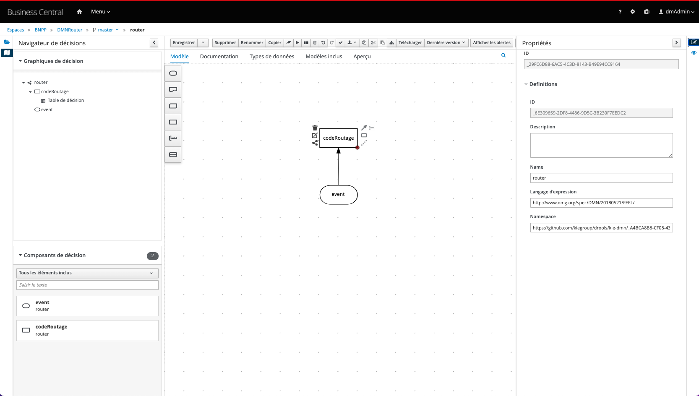
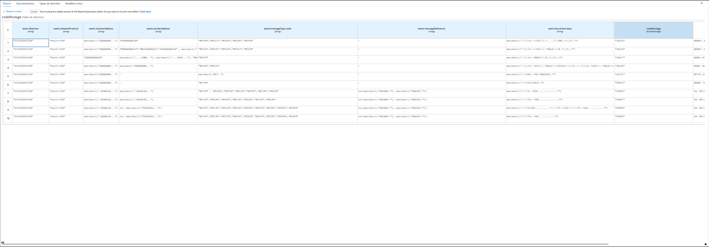
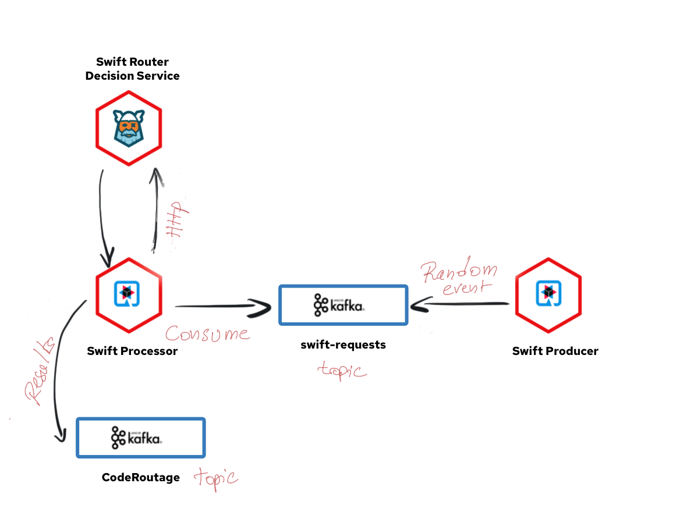

# swift-router


## Description

This demo is a further iteration of rule-based SWIFT message routing; using Quarkus, Springboot, Kogito Drools DMN Engine and Kafka.


## Objectives

Showcase the ability to route data real time through DMN rules maintained by business users and how to enable and consume the runtime metrics monitoring


Testing the demo can be done through :
- rest call
- streaming through kafka 

### Prerequisites
 
You will need:
  - Java 11+ installed 
  - Environment variable JAVA_HOME set accordingly
  - Maven 3.6.2+ installed
  - Docker 19+ (only if you want to run the integration tests and/or you want to use the `docker-compose` script provided in this example).
  - Openshift cli to deploy on Openshift
  - Red Hat Business Automation Operator
  - Red Hat Grafana Operator
  - Red Hat Integration - AMQ Streams Operator


### Create decision service on Red Hat Decision Manager

create Authoring and Execution service in a dev environment
``` 
oc apply -f ./manifest/rhdm-authoring.yml
```

get Decision central url 
```
oc get route swift-router-svc-design-time-rhdmcentr -o json | jq '.spec.host'
```
get kie-server url
```
oc get route swift-router-svc-design-time-kieserver -o json | jq '.spec.host'
```

Log into Decision Central using dmAdmin/dmAdmin

The DMN decision 

 

The router decision table
 


get Business Central API route : 
```
echo $(oc get route swift-router-svc-design-time-rhdmcentr -o json | jq -r '.spec.host')/docs
```

get Kie-server API route : 
```
echo $(oc get route swift-router-svc-design-time-kieserver- -o json | jq -r '.spec.host')/docs
```


#### Test 
call router decision service  
Container-ID : DMNRouter_1.0.0-SNAPSHOT
payload 
```json
    {
    "model-namespace": "https://github.com/kiegroup/drools/kie-dmn/_A4BCA8B8-CF08-433F-93B2-A2598F19ECFF",
    "model-name": "router",
    "event" : {
            "receiverAddress":"XNPAFRPP",
            "messageType":{
                "code":"MT012"
            },
            "TRN":"Test",
            "document":{
                "data":"r{4:5103:EBA7{5:6"
            }
        }
    }
```

```json
curl -X POST "https://swift-router-svc-design-time-kieserver-swift-router.apps.cluster-nq8h5.nq8h5.sandbox1017.opentlc.com/services/rest/server/containers/DMNRouter_1.0.0-SNAPSHOT/dmn/models/router" -H "accept: application/json" -H "content-type: application/json" -d "{\"model-namespace\": \"https://github.com/kiegroup/drools/kie-dmn/_A4BCA8B8-CF08-433F-93B2-A2598F19ECFF\",\"model-name\": \"router\",\"event\" : {\t\t\"receiverAddress\":\"XNPAFRPP\",\t\t\"messageType\":{\t\t\t\"code\":\"MT012\"\t\t},\t\t\"TRN\":\"Test\",\t\t\"document\":{\t\t\t\"data\":\"r{4:5103:EBA7{5:6\"\t\t}\t}}"
```

### Create Kogito Decision Service (.. if you want to create the decision services from scratch )

mvn archetype to generate kogito-quarkus application
```mvn
mvn archetype:generate \
-DarchetypeGroupId=org.kie.kogito \
-DarchetypeArtifactId=kogito-quarkus-dm-archetype \
-DgroupId=com.redhat -DartifactId=swift-router-decision-service-quarkus \
-DarchetypeVersion=1.5.0.redhat-00006 \
-Dversion=1.0-SNAPSHOT
```
mvn archetype to generate kogito-springboot application

```mvn
mvn archetype:generate \
-DarchetypeGroupId=org.kie.kogito \
-DarchetypeArtifactId=kogito-springboot-dm-archetype \
-DgroupId=org.redhat -DartifactId=swift-router-decision-service-springboot \
-DarchetypeVersion=1.5.0.redhat-00006 \
-Dversion=1.0-SNAPSHOT
```
add the following extensions/dependencies :
- for quarkus application :  monitoring-prometheus-quarkus-addon, quarkus-openshift, quarkus-smallrye-health and kogito-scenario-simulation to your pom file
- for springboot : spring-boot-starter-actuator, monitoring-prometheus-springboot-addon, kogito-scenario-simulation
to deploy the apps on openshift, add the the fabric8 plugin to a profile named openshift into springboot pom file :

```xml
    <profile>
      <id>openshift</id>
      <build>
        <plugins>
          <plugin>
            <groupId>io.fabric8</groupId>
            <artifactId>fabric8-maven-plugin</artifactId>
            <version>4.4.1</version>
            <executions>
              <execution>
                <goals>
                  <goal>resource</goal>
                  <goal>build</goal>
                </goals>
              </execution>
            </executions>
          </plugin>
        </plugins>
      </build>
    </profile>
```
copy the decision service from ./assets/router.dmn into your-kogito-application/src/main/resources
you can also copy the tests scenarios from ./assets/codeRoutage.sceim into your-kogito-application/src/test/resources  


#### Start the infra and tests applications


build and package Quarkus Kogito decision service
```
cd swift-router-decision-service-quarkus
mvn clean package
```
build and package SpringBoot Kogito decision service
```
cd ../swift-router-decision-service-quarkus
mvn clean package -DskipTests=true
```

start kafka, kafdrop, springboot kogito decision service, quarkus kogito decision service, prometheus and grafana
```
docker compose up
```

if you want to stop and remove all images 
```
 docker compose down --rmi all --remove-orphans
``` 
endpoint to access to Swagger API :
- quarkus : http://localhost:8080/q/swagger-ui/
- springboot http://localhost:8180/swagger-ui/index.html?configUrl=/v3/api-docs/swagger-config#/springboot-metrics-resource

In the next sections we will explore how to route swift messages through different way :

- http call
- massive http call
- streaming (kafka)
#### http call

go to http://localhost:8080/swagger-ui

call `router` service using the following event :
```json
 {
	"event":{
		"direction":"DISTRIBUTION",
		"networkProtocol":"Swift-FIN",
		"receiverAddress":"GEBABEBBAAA",
		"senderAddress":"ECMSBEBBCCB",
		"messageType":{
			"code":"MT598"
		},
		"document":{
			"data":"55{4:33:20C:AA4444//BKL111{5:RE"
		}
	}
}
```
the response should be 
```json
{
  "event": {
    "receiverAddress": "GEBABEBBAAA",
    "messageReference": null,
    "TRN": null,
    "senderAddress": "ECMSBEBBCCB",
    "messageType": {
      "code": "MT598"
    },
    "document": {
      "data": "55{4:33:20C:AA4444//BKL111{5:RE"
    },
    "networkProtocol": "Swift-FIN",
    "direction": "DISTRIBUTION"
  },
  "codeRoutage": [
    "CAL06"
  ]
}
```
#### massive http call

swift-router-remote-client application invoke x times the swift-router decision service (quarkus or springboot), to specify the number of call and the type of service use (in the examples x = 1000) :
`-Dquarkus.args="1000 springboot"`or `-Dquarkus.args="1000 quarkus"`

the following example invoke springboot decision service 1000 times, insert the result of each call into a topic kafka named `sbCodeRoutage` (and the elapsed time) 
```
cd ../swift-router-remote-client
mvn clean compile quarkus:dev -Dquarkus.args="1000 springboot"
```

the following example invoke quarkus decision service 1000 times, insert the result of each call into a topic kafka named `sbCodeRoutage` (and the elapsed time) 
```
cd ../swift-router-remote-client
mvn clean compile quarkus:dev -Dquarkus.args="1000 quarkus"
```

You can inspect the results using Kafdrop

#### stream swift messages 

The following picture describe how to stream swift events through kafka topics

  

run the processor
```
cd ../swift-router-processor
mvn clean compile quarkus:dev
```
run the producer

```
cd ../swift-router-producer
mvn clean compile quarkus:dev
```

to genrate an event go to http://localhost:8680/swift.html page and click on `Request Router Code`;
the producer apps will produce a random message into `swift-requests` topic, the processor consume the message, invoke the decision service and write the result in the `codeRoutage` topic;
from the swift interface (http://localhost:8680/swift.html), `Pending` text will be replaced with the calculated codes

## build & deploy decisions services as microservices to openshift

log into openshift
```
https://api.openshift_url:6443 -u login -p password 
```
create kafka cluster
```
oc apply -f ./manifest/kafka.yml
```
deploy kafdrop
```
oc apply -f ./manifest/kafdrop.yml
```
build and deploy Quarkus Kogito decision service
```
cd swift-router-kogito-quarkus
mvn clean package -Dquarkus.kubernetesdeploy=true                                                                                   
```       
build and deploy Springboot Kogito decision service 
```
cd ../swift-router-kogito-springboot
mvn clean fabric8:deploy -Popenshift -DskipTests
```  

### build & deploy rest client 

### build & deploy Kafka producer/processor 
build and deploy producer
```
cd ../swift-producer
mvn clean package -Dquarkus.kubernetesdeploy=true                                                                                   
```  

build and deploy processor
```
cd ../swift-processor
mvn clean package -Dquarkus.kubernetesdeploy=true                                                                                   
```  
### Monitoring

In oder to monitor the decision services executions we have to configure OpenShift Container Platform monitoring to scrape metrics from the /metrics endpoints of swift-router-kogito-quarkus and swift-router-kogito-springboot applications 
```
oc apply -f ../manifest/prometheus-service-monitor-openshift.yml
```
grant the grafana-serviceaccount to the cluster-monitoring-view cluster role.
```sh
oc adm policy add-cluster-role-to-user cluster-monitoring-view -z grafana-serviceaccount
```
Get the token 
```
    oc serviceaccounts get-token grafana-serviceaccount
``` 
in the below YAML, substitute ${BEARER_TOKEN} with the output of the command above 
```yaml
    apiVersion: integreatly.org/v1alpha1
    kind: GrafanaDataSource
    metadata:
    name: grafana-prometheus-datasource
    spec:
    datasources:
        - access: proxy
        editable: true
        isDefault: true
        jsonData:
            httpHeaderName1: 'Authorization'
            timeInterval: 5s
            tlsSkipVerify: true
        name: Prometheus
        secureJsonData:
            httpHeaderValue1: 'Bearer ${BEARER_TOKEN}'
        type: prometheus
        url: 'https://thanos-querier.openshift-monitoring.svc.cluster.local:9091'
    name: grafana-prometheus-datasource
```
copy the YAML in ../manifest/grafana-datasouce.yml file
```
oc apply -f ../manifest/grafana-datasouce.yml
```
### Testing

#### HTTP Remote call 

In order to test each service (Springboot and Quarkus implementation), we will deploy two Quarkus rest client applications. The service 1000 times and push the response in a Kafka topic 
get decisions services routes
```
rm ../manifest/swift-cm.properties
echo "SwiftQuarkus_URL=https://$(oc get route swift-router-kogito-quarkus --template={{.spec.host}})" >! ../manifest/swift-cm.properties
echo "SwiftSpringBoot_URL=https://$(oc get route swift-router-kogito-springboot --template={{.spec.host}})" >> ../manifest/swift-cm.properties
```
create a configmap containing 
```
oc create configmap swift-router-cm --from-env-file=../manifest/swift-cm.properties --dry-run -o yaml | oc apply -f -   
```

build and deploy quarkus rest client to call the quarkus decision service
```
 cd ../swift-rest-quarkus-client
 mvn clean package -Dquarkus.kubernetes.deploy=true -Dquarkus.openshift.labels.app-with-metrics=swift-rest-quarkus-client   
```
build and deploy quarkus rest client to call the springboot decision service
```
 cd ../swift-rest-springboot-client
 mvn clean package -Dquarkus.kubernetes.deploy=true -Dquarkus.openshift.labels.app-with-metrics=swift-rest-quarkus-client   
```


# Advanced content routing using quarkus, fuse and kafka 
https://github.com/tarilabs/quarkus-content-based-routing