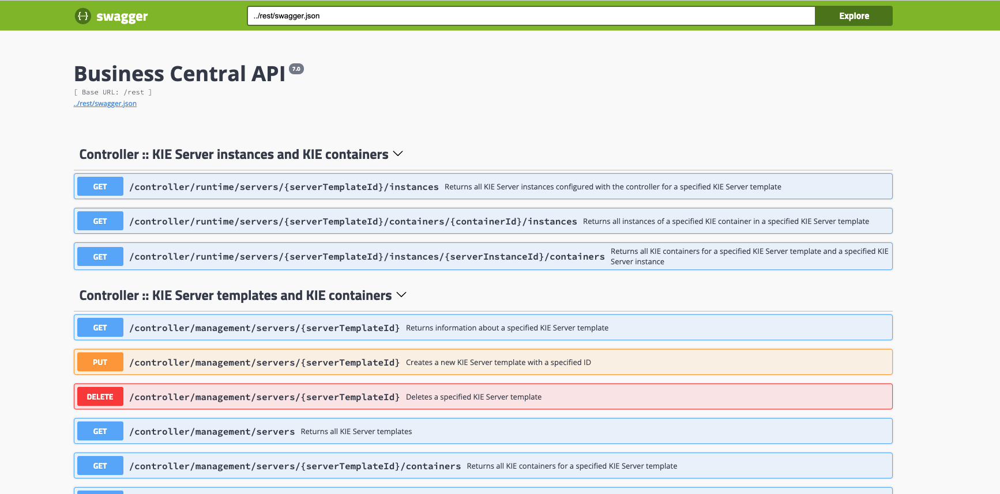
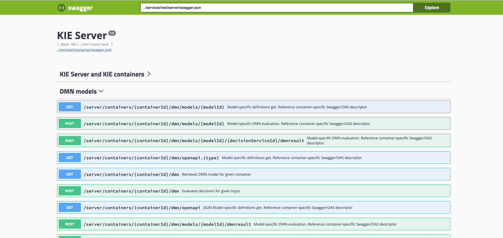
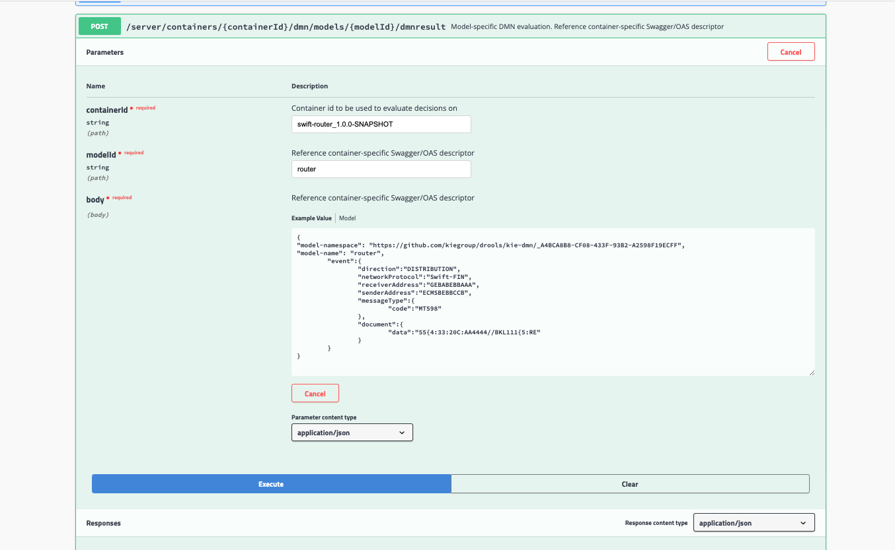
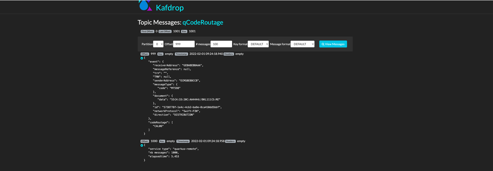
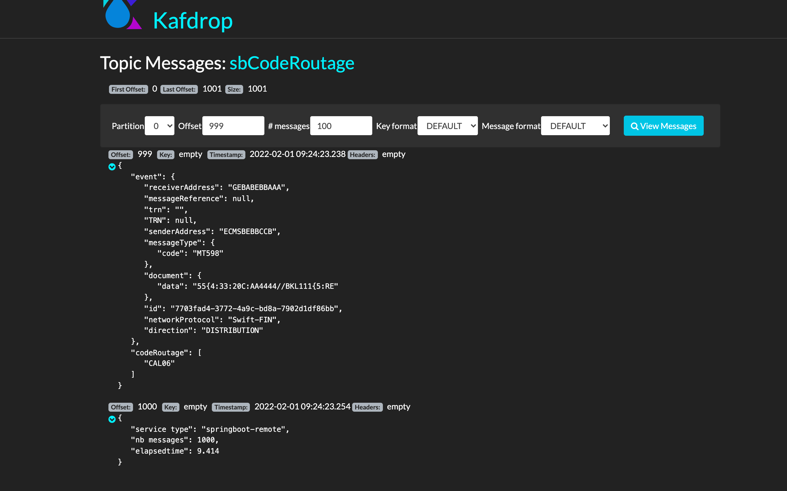
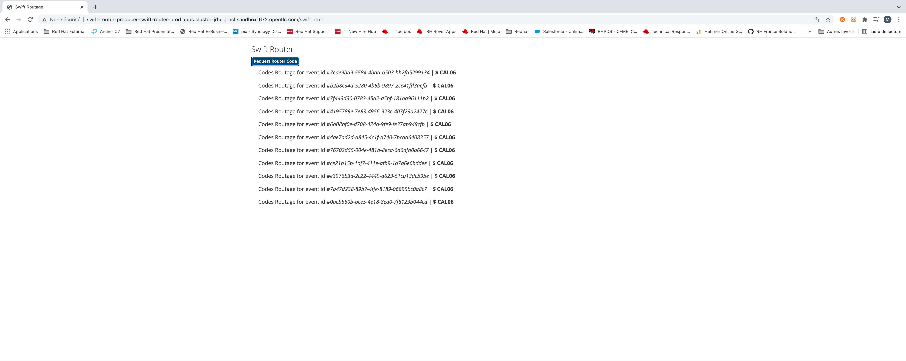
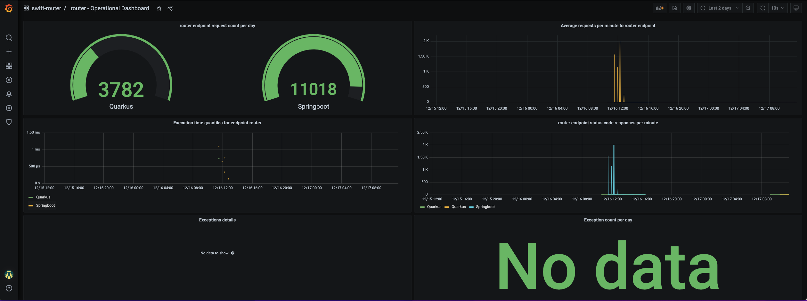

# swift-router

[](https://devspaces.apps.ocp.jpl.ovh/f?url=https://github.com/mouachan/swift-router&che-editor=eclipse/che-theia/latest)

## Description

This demo is a further iteration of rule-based SWIFT message routing; using Quarkus, Springboot, Kogito Drools DMN Engine and Kafka.


## Objectives

Showcase the ability to route data real time through DMN rules maintained by business users and how to enable and consume the runtime metrics monitoring


Testing the demo can be done through :
- rest call
- streaming through kafka 

### Prerequisites
 
You will need:
  - Java 11+ installed 
  - Environment variable JAVA_HOME set accordingly
  - Maven 3.6.2+ installed
  - Docker 19+ (only if you want to run the integration tests and/or you want to use the `docker-compose` script provided in this example).
  - Openshift cli to deploy on Openshift
  - Red Hat Business Automation Operator
  - Red Hat Grafana Operator
  - Red Hat Integration - AMQ Streams Operator


### Create Kogito Decision Service (.. if you want to create the decision services from scratch )

mvn archetype to generate kogito-quarkus application
```mvn
mvn archetype:generate \
-DarchetypeGroupId=org.kie.kogito \
-DarchetypeArtifactId=kogito-quarkus-dm-archetype \
-DgroupId=com.redhat -DartifactId=swift-router-decision-service-quarkus \
-DarchetypeVersion=1.5.0.redhat-00006 \
-Dversion=1.0-SNAPSHOT
```
mvn archetype to generate kogito-springboot application

```mvn
mvn archetype:generate \
-DarchetypeGroupId=org.kie.kogito \
-DarchetypeArtifactId=kogito-springboot-dm-archetype \
-DgroupId=org.redhat -DartifactId=swift-router-decision-service-springboot \
-DarchetypeVersion=1.5.0.redhat-00006 \
-Dversion=1.0-SNAPSHOT
```
add the following extensions/dependencies :
- for quarkus application :  monitoring-prometheus-quarkus-addon, quarkus-openshift, quarkus-smallrye-health and kogito-scenario-simulation to your pom file
- for springboot : spring-boot-starter-actuator, monitoring-prometheus-springboot-addon, kogito-scenario-simulation
to deploy the apps on openshift, add the the fabric8 plugin to a profile named openshift into springboot pom file :

```xml
    <profile>
      <id>openshift</id>
      <build>
        <plugins>
          <plugin>
            <groupId>io.fabric8</groupId>
            <artifactId>fabric8-maven-plugin</artifactId>
            <version>4.4.1</version>
            <executions>
              <execution>
                <goals>
                  <goal>resource</goal>
                  <goal>build</goal>
                </goals>
              </execution>
            </executions>
          </plugin>
        </plugins>
      </build>
    </profile>
```
copy the decision service from ./assets/router.dmn into your-kogito-application/src/main/resources
you can also copy the tests scenarios from ./assets/codeRoutage.sceim into your-kogito-application/src/test/resources  


#### Start the infra and tests applications


build and package Quarkus Kogito decision service
```
cd swift-router-decision-service-quarkus
mvn clean package
```
build and package SpringBoot Kogito decision service
```
cd ../swift-router-decision-service-quarkus
mvn clean package -DskipTests=true
```

start kafka, kafdrop, springboot kogito decision service, quarkus kogito decision service, prometheus and grafana
```
docker compose up
```

if you want to stop and remove all images 
```
 docker compose down --rmi all --remove-orphans
``` 
endpoint to access to Swagger API :
- quarkus : http://localhost:8080/q/swagger-ui/
- springboot http://localhost:8180/swagger-ui/index.html?configUrl=/v3/api-docs/swagger-config#/springboot-metrics-resource

In the next sections we will explore how to route swift messages through different way :

- http call
- massive http call
- streaming (kafka)
#### http call

go to http://localhost:8080/swagger-ui

call `router` service using the following event :
```json
 {
	"event":{
		"direction":"DISTRIBUTION",
		"networkProtocol":"Swift-FIN",
		"receiverAddress":"GEBABEBBAAA",
		"senderAddress":"ECMSBEBBCCB",
		"messageType":{
			"code":"MT598"
		},
		"document":{
			"data":"55{4:33:20C:AA4444//BKL111{5:RE"
		}
	}
}
```
the response should be 
```json
{
  "event": {
    "receiverAddress": "GEBABEBBAAA",
    "messageReference": null,
    "TRN": null,
    "senderAddress": "ECMSBEBBCCB",
    "messageType": {
      "code": "MT598"
    },
    "document": {
      "data": "55{4:33:20C:AA4444//BKL111{5:RE"
    },
    "networkProtocol": "Swift-FIN",
    "direction": "DISTRIBUTION"
  },
  "codeRoutage": [
    "CAL06"
  ]
}
```
#### http call

swift-router-remote-client application invoke x times the swift-router decision service (quarkus or springboot), to specify the number of call and the type of service use the following arguments:
`-Dquarkus.args="1000 springboot"`or `-Dquarkus.args="1000 quarkus"`

the following example invoke springboot decision service 1000 times, the result of each call is inserted into a topic kafka named `sbCodeRoutage` (and the elapsed time) 
```
cd ../swift-router-remote-client
mvn clean compile quarkus:dev -Dquarkus.args="1000 springboot"
```

the following example invoke quarkus decision service 1000 times, the result of each call is inserted into a topic kafka named `qCodeRoutage` (and the elapsed time) 
```
cd ../swift-router-remote-client
mvn clean compile quarkus:dev -Dquarkus.args="1000 quarkus"
```

You can inspect the results using Kafdrop

#### stream swift messages 

The following picture describe how to stream swift events through kafka topics

  

run the processor
```
$ cd ../swift-router-processor
$ mvn clean compile quarkus:dev
```
run the producer

```
$ cd ../swift-router-producer
$ mvn clean compile quarkus:dev
```

to genrate an event go to http://localhost:8680/swift.html page and click on `Request Router Code`;
the producer apps will generate a random message into `swift-requests` topic; the processor consume the message, invoke the decision service and write the result into the `codeRoutage` topic;
from the swift interface (http://localhost:8680/swift.html), `Pending` text will be replaced by the calculated codes

## Deploy on openshift

log into openshift
```
https://api.openshift_url:6443 -u login -p password 
```

create a dev, test and prod environment
```
$ oc new-project swift-router-dev
$ oc new-project swift-router-test
$ oc new-project swift-router-prod  
```
from OperatorHub install on swift-router-dev environment (namespace):
  - Red Hat Business Automation Operator

from OperatorHub install on swift-router-test and swift-router-prod environments (namespaces):

  - Red Hat Grafana Operator
  - Red Hat Integration - AMQ Streams Operator

### Configure kafka (on test and production environments)
create kafka cluster
```
$ oc apply -f ./manifest/kafka.yml
kafka.kafka.strimzi.io/swift-cluster created
```
wait until the kafka cluster is up and running 
```
$ oc get kafka
NAME            DESIRED KAFKA REPLICAS   DESIRED ZK REPLICAS   READY   WARNINGS
swift-cluster   3                        3                     True 
```
deploy kafdrop (to monitor topics)
```
$ oc apply -f ./manifest/kafdrop.yml
deploymentconfig.apps.openshift.io/kafdrop created
service/kafdrop created
route.route.openshift.io/kafdrop created
```
### configure Monitoring

In oder to monitor the decision services executions we have to configure OpenShift Container Platform monitoring to scrape metrics from the /metrics endpoints of swift-router-kogito-quarkus and swift-router-kogito-springboot applications 
```
$ oc apply -f ./manifest/prometheus-service-monitor-openshift.yml
$ oc get servicemonitor
NAME                                               AGE
swift-router-decision-service-quarkus-monitor      78s
swift-router-decision-service-springboot-monitor   78s
```

create grafana instance
```
$ oc apply -f ./manifest/grafana-instance.yml
wait until the grafana instance is `success`
$ oc get grafana -o json | jq '.items[0].status.message'
"success"
```
grant the grafana-serviceaccount to the cluster-monitoring-view cluster role.
```sh
$ oc adm policy add-cluster-role-to-user cluster-monitoring-view -z grafana-serviceaccount
clusterrole.rbac.authorization.k8s.io/cluster-monitoring-view added: "grafana-serviceaccount"
```
Get the token 
```
oc serviceaccounts get-token grafana-serviceaccount
``` 
in the below YAML, substitute ${BEARER_TOKEN} with the output of the command above 
```yaml
    apiVersion: integreatly.org/v1alpha1
    kind: GrafanaDataSource
    metadata:
    name: grafana-prometheus-datasource
    spec:
    datasources:
        - access: proxy
        editable: true
        isDefault: true
        jsonData:
            httpHeaderName1: 'Authorization'
            timeInterval: 5s
            tlsSkipVerify: true
        name: Prometheus
        secureJsonData:
            httpHeaderValue1: 'Bearer ${BEARER_TOKEN}'
        type: prometheus
        url: 'https://thanos-querier.openshift-monitoring.svc.cluster.local:9091'
    name: grafana-prometheus-datasource
```
copy the YAML in ../manifest/grafana-datasource.yml file and create the datasource
```
$ oc apply -f ./manifest/grafana-datasource.yml
```
Then create the dashboard
```
$ oc apply -f ./manifest/grafana-dashboard-operational.yml
```

### Create decision service on Red Hat Decision Manager

create Authoring and Execution service in the dev environment
``` 
$ oc project swift-router-dev
$ oc apply -f ./manifest/rhdm-authoring.yml
```
wait until KieApp is deployed
```
$ oc get KieApp
NAME                           VERSION   ENVIRONMENT      STATUS     AGE
swift-router-svc-design-time   7.11.1    rhdm-authoring   Deployed   2m46s
```
check the pods `swift-router-svc-design-time-rhdmcentr-1-*` and `swift-router-svc-design-time-kieserver-1-*` are ready and running
```
$ oc get pods                                                                  16:44:44
NAME                                              READY   STATUS      RESTARTS   AGE
business-automation-operator-758bd597fb-29ghp     1/1     Running     0          5m14s
console-cr-form                                   2/2     Running     0          4m46s
swift-router-svc-design-time-kieserver-1-deploy   0/1     Completed   0          4m44s
swift-router-svc-design-time-kieserver-1-g6hnn    1/1     Running     0          4m41s
swift-router-svc-design-time-rhdmcentr-1-9dm6z    1/1     Running     0          4m41s
swift-router-svc-design-time-rhdmcentr-1-deploy   0/1     Completed   0          4m44s
```

get Decision central host 
```
$ oc get route swift-router-svc-design-time-rhdmcentr -o json | jq -r '.spec.host'
swift-router-svc-design-time-rhdmcentr-swift-router-dev.apps.cluster-8tqhw.8tqhw.sandbox1544.opentlc.com
```
get kie-server host
```
$ oc get route swift-router-svc-design-time-kieserver -o json | jq -r '.spec.host'
swift-router-svc-design-time-kieserver-swift-router-dev.apps.cluster-8tqhw.8tqhw.sandbox1544.opentlc.com
```

log into Decision Central (ex : https://swift-router-svc-design-time-rhdmcentr-swift-router-dev.apps.cluster-8tqhw.8tqhw.sandbox1544.opentlc.com)using dmAdmin/dmAdmin (if you use chrome and you have the unsecure warning type in ypur browser `thisisunsafe`)
create a new space named `swift`, then into `swift`create a project named `swift-router`

import the DMN ./assets/router.dmn, the DMN decision looks like 

 

and the router decision table
 

import the scenarios tests from ./assets/codeRoutage.scesim

click on `deploy` button, wait until the success message is displayed 

to explore the API 
get Business Central API route : 
```
echo $(oc get route swift-router-svc-design-time-rhdmcentr -o json | jq -r '.spec.host')/docs
```
 
get Kie-server API route : 
```
echo $(oc get route swift-router-svc-design-time-kieserver -o json | jq -r '.spec.host')/docs
```
 

#### Test 

access to the swagger kie-server api to invoke ethe service 
```
echo $(oc get route swift-router-svc-design-time-kieserver -o json | jq -r '.spec.host')/docs
swift-router-svc-design-time-kieserver-swift-router-dev.apps.cluster-8tqhw.8tqhw.sandbox1544.opentlc.com/docs
```

call the `router` rest endpoint decision service with following properties :
Swagger URL : http://swift-router-svc-design-time-kieserver-swift-router-dev.apps.cluster-8tqhw.8tqhw.sandbox1544.opentlc.com/docs
 
Click on DMN models and select the POST `/server/containers/{containerId}/dmn/models/{modelId}/dmnresult` endpoint 
- containerId : `swift-router_1.0.0-SNAPSHOT`
- modelId: `router`
- payload : 

```json
    {
    "model-namespace": "https://github.com/kiegroup/drools/kie-dmn/_A4BCA8B8-CF08-433F-93B2-A2598F19ECFF",
    "model-name": "router",
        "event":{
            "direction":"DISTRIBUTION",
            "networkProtocol":"Swift-FIN",
            "receiverAddress":"GEBABEBBAAA",
            "senderAddress":"ECMSBEBBCCB",
            "messageType":{
                "code":"MT598"
            },
            "document":{
                "data":"55{4:33:20C:AA4444//BKL111{5:RE"
            }
        }
    }
```
Response 

```json
{
  "namespace": "https://github.com/kiegroup/drools/kie-dmn/_A4BCA8B8-CF08-433F-93B2-A2598F19ECFF",
  "modelName": "router",
  "dmnContext": {
    "model-namespace": "https://github.com/kiegroup/drools/kie-dmn/_A4BCA8B8-CF08-433F-93B2-A2598F19ECFF",
    "model-name": "router",
    "event": {
      "receiverAddress": "GEBABEBBAAA",
      "messageReference": null,
      "TRN": null,
      "senderAddress": "ECMSBEBBCCB",
      "messageType": {
        "code": "MT598"
      },
      "document": {
        "data": "55{4:33:20C:AA4444//BKL111{5:RE"
      },
      "id": null,
      "networkProtocol": "Swift-FIN",
      "direction": "DISTRIBUTION"
    },
    "codeRoutage": [
      "CAL06"
    ]
  },
  "messages": [],
  "decisionResults": [
    {
      "decisionId": "_E2323A0A-211D-4548-B8BF-DFE6B743F463",
      "decisionName": "codeRoutage",
      "result": [
        "CAL06"
      ],
      "messages": [],
      "evaluationStatus": "SUCCEEDED"
    }
  ]
}
```

or use the command curl

```
curl -X POST "https://swift-router-svc-design-time-kieserver-swift-router-dev.apps.cluster-8tqhw.8tqhw.sandbox1544.opentlc.com/services/rest/server/containers/swift-router_1.0.0-SNAPSHOT/dmn/models/router/dmnresult" 
-H "accept: application/json" -H "content-type: application/json" 
-d "{
    \"model-namespace\": \"https://github.com/kiegroup/drools/kie-dmn/_A4BCA8B8-CF08-433F-93B2-A2598F19ECFF\",
    \"model-name\": \"router\",
    \t\"event\":{
        \t\t\"direction\":\"DISTRIBUTION\",
        \t\t\"networkProtocol\":\"Swift-FIN\",
        \t\t\"receiverAddress\":\"GEBABEBBAAA\",
        \t\t\"senderAddress\":\"ECMSBEBBCCB\",
        \t\t\"messageType\":{
            \t\t\t\"code\":\"MT598\"\t\t
            },
            \t\t\"document\":{
                \t\t\t\"data\":\"55{4:33:20C:AA4444//BKL111{5:RE\"
            \t\t}\t
            }
    }"
```

### build & deploy decisions services in prod environment

```
oc project swift-router-prod
```

build and deploy Quarkus Kogito decision service
```
cd swift-router-decision-service-quarkus
mvn clean package -Dquarkus.kubernetes.deploy=true                                                                                   
```       
build and deploy Springboot Kogito decision service 
```
cd ../swift-router-decision-service-springboot
mvn clean fabric8:deploy -Popenshift -DskipTests

if you want to test manually each service, use the swagger-ui

Quarkus : http://swift-router-decision-service-quarkus-swift-router-prod.apps.cluster-jrhcl.jrhcl.sandbox1672.opentlc.com/q/swagger-ui/
Springboot : http://swift-router-decision-service-springboot-swift-router-prod.apps.cluster-jrhcl.jrhcl.sandbox1672.opentlc.com/swagger-ui/index.html?configUrl=/v3/api-docs/swagger-config#/springboot-metrics-resource
```  

### build & deploy clients in prod environment

create a properties file containing decisions services endpoints & kafka cluster bootstrap
```
echo "SwiftQuarkus_URL=http://$(oc get route swift-router-decision-service-quarkus --template={{.spec.host}})" > /tmp/swift-cm.properties
echo "SwiftSpringBoot_URL=http://$(oc get route swift-router-decision-service-springboot --template={{.spec.host}})" >> /tmp/swift-cm.properties
echo "KAFKA_BOOTSTRAP_SERVERS=swift-cluster-kafka-bootstrap:9092" >> /tmp/swift-cm.properties
```
create a configmap containing decisions services Urls  
```
oc create configmap swift-router-cm --from-env-file=/tmp/swift-cm.properties --dry-run=client -o yaml | oc apply -f -   
```

build and deploy quarkus rest client to call the quarkus decision service
```
 cd ../swift-router-remote-client
 mvn clean package -Dquarkus.kubernetes.deploy=true -Dquarkus.openshift.labels.app-with-metrics=swift-router-remote-client   
```
then change the number of replicas to 0
```
oc scale dc swift-router-remote-client --replicas=0 
```
get the image url of swift-router-remote-client
```
oc get dc swift-router-remote-client -o=jsonpath='{$.spec.template.spec.containers[:1].image}' 
image-registry.openshift-image-registry.svc:5000/swift-router-prod/swift-router-remote-client@sha256:e100c55534daf36f0c8a52e756539b18c8645de738b5231bdcadd780bddca69d
```

replace the  2 occurences (line 15 and 57) of ${IMAGE_SWIFT_ROUTE_REMOTE_CLIENT}  by the image url found beforein  ../manifest/swift-router-remote-client-job.yml 
to test Quarkus and Springboot decision services, deploy 2 kubernetes Jobs. Each job call the decision service 1000 times, all results are produced into kafka topics `sbCodeRoutage` for springboot and `qCodeRoutage`for quarkus
```
oc apply -f ../manifest/swift-router-remote-client-job.yml
```
use kafdrop to check the calculated messages (use http instead of https)
```
oc get route kafdrop
NAME      HOST/PORT                                                                    PATH   SERVICES   PORT   TERMINATION   WILDCARD
kafdrop   kafdrop-swift-router-prod.apps.cluster-jrhcl.jrhcl.sandbox1672.opentlc.com          kafdrop    9000                 None
```
From kafdrop UI, click on `qCodeRoutage` topic, then on "view message", put 999 into Offset and click on `View Messages` button 
 
  
the calculated code is `CAL06`
the invoked service is `Quarkus`, as expected the number of messages is `1000` and the elapsed time is `5.453s`
```json
{
   "service type": "quarkus-remote",
   "nb messages": 1000,
   "elapsedtime": 5.453
}
```
to view the other calculated codes, change the offset to 0 (you should have 1001 messages)

From kafdrop UI, click on if ypu click on `sbCodeRoutage` topic 
 
the calculated code is `CAL06`
the invoked service is `SpringBoot`, as expected the number of messages is `1000` and the elapsed time is `5.453s`
```json
{
   "service type": "springboot-remote",
   "nb messages": 1000,
   "elapsedtime": 9.414
}
```
### build & deploy Kafka producer/processor applications 
build and deploy producer
```
cd ../swift-router-producer
mvn clean package -Dquarkus.kubernetes.deploy=true
```  

build and deploy processor
```
cd ../swift-router-processor
mvn clean package -Dquarkus.kubernetes.deploy=true
```  

get the route of the producer
```
oc get route swift-router-producer
NAME                    HOST/PORT                                                                                          PATH   SERVICES                PORT   TERMINATION   WILDCARD
swift-router-producer   swift-router-producer-swift-router-prod.apps.cluster-jrhcl.jrhcl.sandbox1672.opentlc.com          swift-router-producer   8680                 None
```
to genrate an event go to http://swift-router-producer-swift-router-prod.apps.cluster-jrhcl.jrhcl.sandbox1672.opentlc.com//swift.html page and click on `Request Router Code`;
the producer apps will generate a random message into `swift-requests` topic; the processor consume the message, invoke the decision service and write the result into the `codeRoutage` topic;
from the swift interface (http://swift-router-producer-swift-router-prod.apps.cluster-jrhcl.jrhcl.sandbox1672.opentlc.com//swift.html), `Pending` text will be replaced by the calculated codes

 

### Monitor 

#### HTTP Remote call 


Do some http call to the quarkus/springboot decision service, log into grafana, select the dashboard `router - Operational Dashboard` 

  


# Advanced content routing using quarkus, fuse and kafka 
https://github.com/tarilabs/quarkus-content-based-routing
